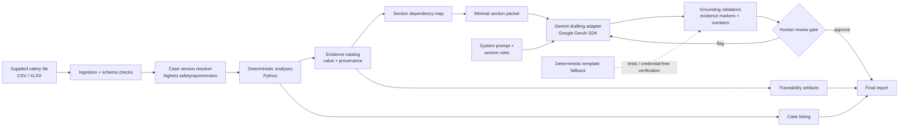

# Architecture

**Candidate:** Reema Pandya

## Design intent

Gemini is deliberately downstream of deterministic computation. It never receives the raw workbook and never performs authoritative arithmetic. Each report section declares the evidence keys it needs; the packet builder sends only those keys plus provenance and a section-specific drafting rule.

That boundary is the core safety property of the prototype: exact facts are produced by code, while Gemini is used for concise synthesis and neutral regulatory wording. Unsupported numbers, unknown evidence markers, and prohibited safety conclusions are rejected before human review.

The human gate sits after automated grounding checks. A flagged section is not emitted as final. In an operational implementation, review state would also persist reviewer identity, timestamp, model/prompt version, source hash, and the reason for any edit or rejection.
